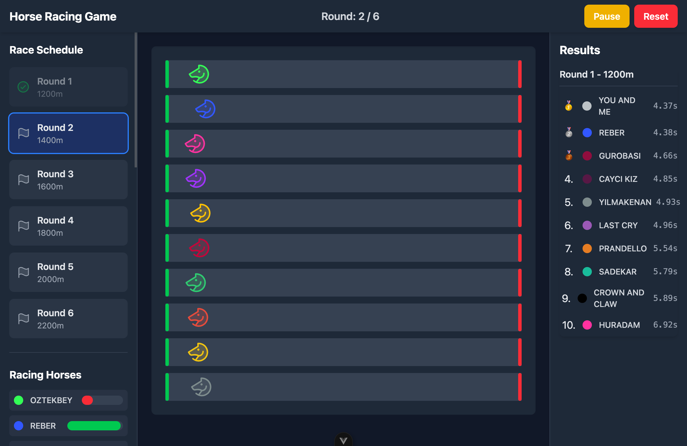
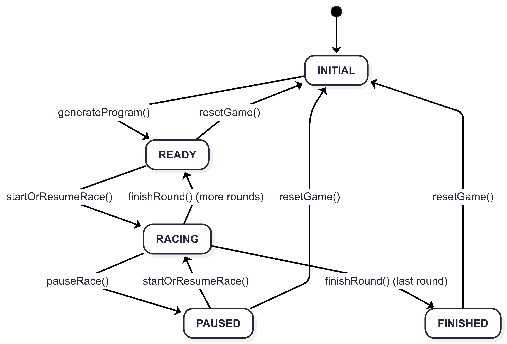

# Horse Racing Game





This project is a web-based horse racing simulation game. It allows users to view a schedule of upcoming races, see the participating horses, and watch the races unfold in real-time on a virtual track. Once a race is complete, the results are displayed, showing the finishing order of the horses.

The application is built using a modern Vue stack:

- **Vue 3:** For building the user interface with its component-based architecture and reactivity system.
- **Vite:** As the build tool, providing a fast development server with hot module replacement and optimized production builds.
- **Pinia:** For state management, handling the global state of the application such as race data, horse information, and race outcomes.
- **TypeScript:** For static typing, improving code quality and maintainability.
- **Tailwind CSS:** For styling the application with a utility-first CSS framework.
- **Vitest & Playwright:** For unit and end-to-end testing to ensure the application is robust and works as expected.

## Project Setup

```sh
npm install
```

### Compile and Hot-Reload for Development

```sh
npm run dev
```

### Type-Check, Compile and Minify for Production

```sh
npm run build
```

### Run Unit Tests with Vitest

```sh
npm run test:unit
```

### Run End-to-End Tests with Playwright

```sh
npm run test:e2e
```

### Lint with ESLint

```sh
npm run lint
```
